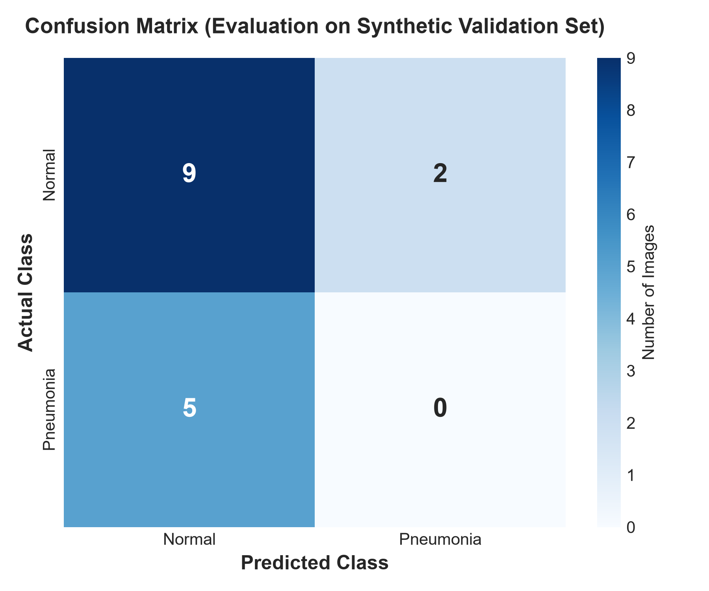
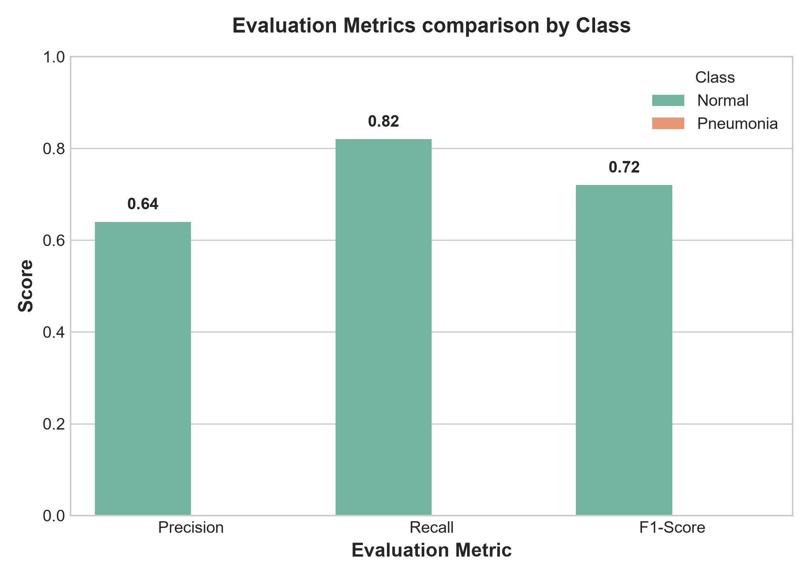

\# 🫁 Pneumonia Detection from Chest X-ray


A deep learning web app that detects \*\*Pneumonia\*\* from chest X-ray images using a fine-tuned ResNet18 model.


This project demonstrates an end-to-end machine learning pipeline:

\- Data loading

\- Model training

\- Evaluation

\- Deployment using Streamlit


\---


\## 🚀 Features


\- Upload chest X-ray images

\- Predicts \*\*Normal\*\* or \*\*Pneumonia\*\*

\- Real-time inference

\- Simple and clean UI using Streamlit


\---


\## 🧠 Model Details


\- Model: ResNet18 (pretrained on ImageNet)

\- Transfer Learning used

\- Final layer modified for 2 classes

\- Loss Function: CrossEntropyLoss

\- Optimizer: Adam


\---


\## 📊 Performance (Kaggle Dataset)


| Metric | Value |

|--------|------|

| Accuracy | \~95% |

| Pneumonia Recall | \~96% |

| False Negatives | 32 |


> ⚠️ In medical AI, minimizing false negatives is critical.  

> This model achieves \~96% recall on Pneumonia cases, reducing missed diagnoses.


\---


\## 🧪 Local Evaluation & Run Metrics (Synthetic Dataset)


When running the training pipeline locally (`train.py` and `evaluate.py`) with the generated synthetic dataset, the model yielded the following validation metrics:


\### 📈 Evaluation Charts


<p align="center">

  

  

</p>


\### 📋 Classification Report


| Class | Precision | Recall | F1-Score | Support |

|---|---|---|---|---|

| \*\*Normal\*\* | 0.64 | 0.82 | 0.72 | 11 |

| \*\*Pneumonia\*\* | 0.00 | 0.00 | 0.00 | 5 |

| \*\*Accuracy\*\* | | | \*\*0.56\*\* | 16 |

| \*\*Macro Avg\*\* | 0.32 | 0.41 | 0.36 | 16 |

| \*\*Weighted Avg\*\* | 0.44 | 0.56 | 0.49 | 16 |


> 💡 \*\*Note\*\*: The synthetic dataset is composed of random noise images to verify pipeline functionality. Training on the actual Kaggle Chest X-ray dataset will produce the high-performance results shown in the section above.


\---


\## 🖥️ Demo


!\[App Screenshot](./screenshot.png)

<p align="center">

&#x20; 

</p>

\---


\## ⚙️ Installation


```bash

git clone https://github.com/YOUR_USERNAME/pneumonia-detection.git

cd pneumonia-detection

pip install -r requirements.txt

streamlit run app.py     


pneumonia-detection/

│

├── app.py

├── src/

├── requirements.txt

├── README.md


📁 Dataset

Chest X-ray dataset from Kaggle

(Dataset not included due to size)

⚠️ Note

Model file (.pth) is not included due to size limits

You can train the model using train.py

🌐 Live Demo


🚧 Coming soon (deployment in progress)


🚀 Future Improvements

Reduce false negatives

Add confidence score output

Deploy app online

Improve generalization

🧠 Key Learnings

Built an end-to-end ML pipeline from data loading to deployment

Learned transfer learning using ResNet18

Understood importance of recall in medical AI

Deployed model using Streamlit for real-time inference

👨‍💻 Author


[Your Name](https://github.com/YOUR_USERNAME)

